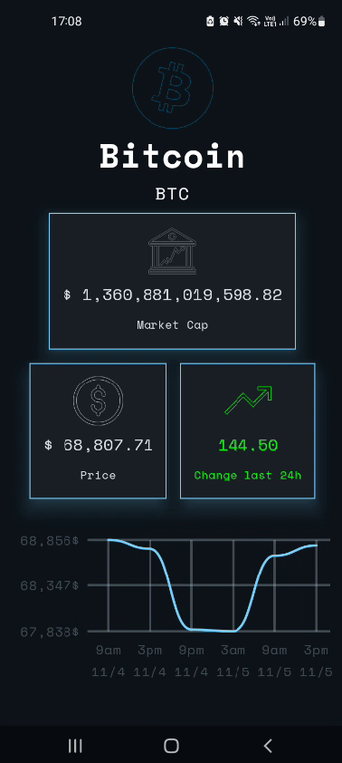
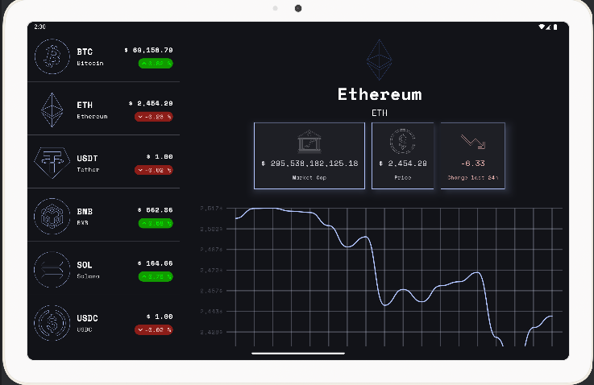

# Crypto Coin Tracker App
Crypto Coin Tracker is a sleek and modern Android application that provides real-time cryptocurrency tracking with a minimalist dark theme design. Built with Clean Architecture and MVI pattern, the app delivers a seamless experience for monitoring major cryptocurrencies like Bitcoin, Ethereum, and various stablecoins.

## 🎨 Modern UI with Jetpack Compose

The app features a carefully crafted UI using Jetpack Compose with a dark theme optimized for crypto trading:

### 📱 Coin List Screen
* Clean, minimalist list showing key cryptocurrencies
* Each coin entry displays:
  * Custom vector icon for each cryptocurrency
  * Current price in USD
  * 24-hour price change percentage with color indicators (green/red)
* Smooth navigation between list and detail views
* Support for both phone and tablet layouts

### 📈 Coin Detail Screen
* Large coin icon and name header
* Key metrics displayed in card format:
  * Market Cap
  * Current Price
  * 24h Price Change
* Interactive price chart showing price movements:
  * Time-based price data
  * Grid lines for better readability
  * Timestamp markers
* Responsive layout adapting to different screen sizes

# 📱 Screens

<table>
  <tr>
    <th>Coin List Page</th>
    <th>Coin List Page(Light Mode)</th>
    <th>Coin Detail Page</th>
  </tr>
  <tr>
    <td></td>
    <td></td>
    <td></td>
  </tr>
</table>

<table>
  <tr>
      <th>Coin Detail Page (Tablet)</th>
  </tr>
  <tr>
   <td></td>
  </tr>
</table>

# 🛠️ Project Tech Stack & Open-source Libraries

1. [Clean Architecture](https://blog.cleancoder.com/uncle-bob/2012/08/13/the-clean-architecture.html): Clean Architecture is an architectural pattern for designing software systems.
   - Data Layer: While the UI layer contains UI-related state and UI logic, the data layer contains application data and business logic. The business logic is what gives value to your app—it's made of real-world business rules that determine how application data must be created, stored, and changed.
   - Domain Layer: The domain layer is responsible for encapsulating complex business logic, or simple business logic that is reused by multiple ViewModels. This layer is optional because not all apps will have these requirements. You should only use it when needed-for example, to handle complexity or favor reusability.
   - UI Layer: The role of the UI is to display the application data on the screen and also to serve as the primary point of user interaction. Whenever the data changes, either due to user interaction (like pressing a button) or external input (like a network response), the UI should update to reflect those changes.

2. [MVI (Model-View-Intent)](https://medium.com/@mohammedkhudair57/mvi-architecture-pattern-in-android-0046bf9b8a2e): A unidirectional data flow pattern where user actions are translated into intents, which modify the model (state), which then updates the view. This creates a predictable state management system.

3. [Jetpack Compose](https://developer.android.com/jetpack/compose): Android's modern toolkit for building native UI. It simplifies and accelerates UI development using a declarative approach with Kotlin.

4. [Coroutines](https://developer.android.com/kotlin/coroutines): A concurrency design pattern that you can use on Android to simplify code that executes asynchronously. Coroutines help manage long-running tasks that might otherwise block the main thread and cause your app to become unresponsive.

5. [Flow](https://developer.android.com/kotlin/flow): Flows are built on top of coroutines and can provide multiple values. A flow is conceptually a stream of data that can be computed asynchronously.

6. [Koin](https://insert-koin.io/): A pragmatic and lightweight dependency injection framework for Kotlin. It provides a simple and efficient way to manage dependencies in your application.

7. [Ktor](https://ktor.io/): A modern asynchronous framework for creating HTTP clients and servers. In Android, it's primarily used as a networking client for making API requests.

8. [Adaptive Navigation](https://developer.android.com/develop/ui/compose/layouts/adaptive/build-adaptive-navigation): A navigation pattern that automatically adapts to different screen sizes and device configurations, ensuring a consistent user experience across various form factors.

9. [Canvas](https://developer.android.com/develop/ui/compose/graphics/draw/overview): A drawing API in Android that allows for custom graphics and animations. In Compose, it provides a modern declarative API for drawing custom shapes and graphics.

